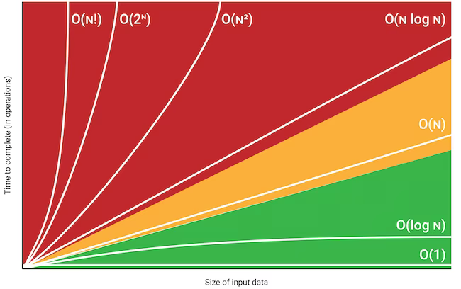
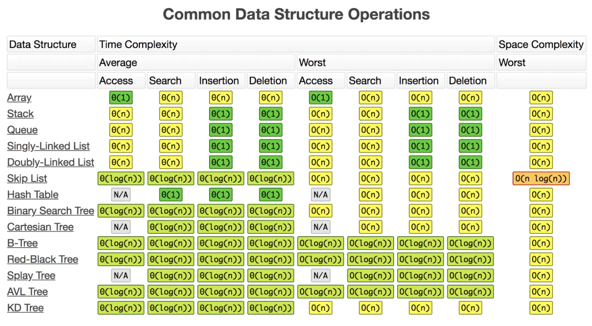
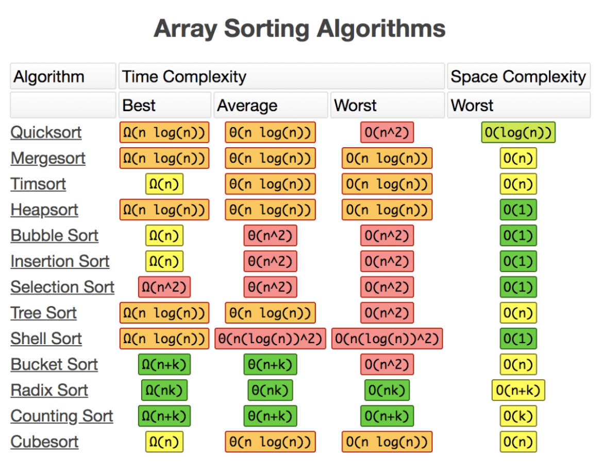

# Big-O

Big-O mide **cómo crece** el tiempo (o la memoria) que necesita un algoritmo a medida que crece el tamaño del input — no cuántos milisegundos tarda exactamente. Dos algoritmos O(n) pueden tener tiempos reales muy distintos (uno con más overhead por operación que el otro), pero ambos van a duplicar su tiempo si el input se duplica; eso es lo que la notación captura, no el número absoluto.

## Cómo se deriva de código

Se cuenta la operación que domina a medida que `n` crece, y se descartan constantes y términos de menor orden — `O(2n + 100)` se escribe `O(n)`, porque para `n` grande el `100` y el `2` dejan de importar frente al crecimiento de `n`.

```python
def buscar(lista, objetivo):      # O(n) — en el peor caso recorre toda la lista
    for x in lista:
        if x == objetivo:
            return True
    return False

def buscar_anidado(lista):        # O(n²) — un loop adentro de otro, cada uno recorre n
    for i in lista:
        for j in lista:
            if i == j:
                ...
```

## Las clases de complejidad, de mejor a peor

| Notación | Nombre | Ejemplo típico |
|---|---|---|
| O(1) | Constante | Acceso a un índice de array, lookup en hash table |
| O(log n) | Logarítmica | Búsqueda binaria — cada paso descarta la mitad de lo que queda |
| O(n) | Lineal | Recorrer una lista una vez |
| O(n log n) | Linearítmica | Los algoritmos de sorting eficientes (Timsort, mergesort, quicksort) |
| O(n²) | Cuadrática | Loops anidados sobre la misma colección |
| O(2ⁿ) | Exponencial | Fuerza bruta probando todas las combinaciones posibles (ej. subsets) |

```python
def busqueda_binaria(lista_ordenada, objetivo):  # O(log n)
    inicio, fin = 0, len(lista_ordenada) - 1
    while inicio <= fin:
        medio = (inicio + fin) // 2
        if lista_ordenada[medio] == objetivo:
            return medio
        elif lista_ordenada[medio] < objetivo:
            inicio = medio + 1      # descarta la mitad izquierda
        else:
            fin = medio - 1         # descarta la mitad derecha
    return -1
```

```python
def merge_sort(lista):    # O(n log n)
    if len(lista) <= 1:
        return lista
    medio = len(lista) // 2
    izquierda = merge_sort(lista[:medio])   # log n niveles de división a la mitad
    derecha = merge_sort(lista[medio:])
    return merge(izquierda, derecha)        # cada nivel hace O(n) trabajo mezclando

def merge(izquierda, derecha):
    resultado = []
    i = j = 0
    while i < len(izquierda) and j < len(derecha):   # recorre ambas mitades una sola vez: O(n)
        if izquierda[i] <= derecha[j]:
            resultado.append(izquierda[i]); i += 1
        else:
            resultado.append(derecha[j]); j += 1
    return resultado + izquierda[i:] + derecha[j:]
```

`merge_sort` divide la lista a la mitad recursivamente (`log n` niveles, como la búsqueda binaria) y en cada nivel mezcla todos los elementos (`O(n)` trabajo) — `log n` niveles × `O(n)` por nivel = `O(n log n)` en total. Es la misma razón por la que Timsort, mergesort y quicksort comparten esa complejidad: dividir y combinar.

Cada clase, en orden, crece **mucho** más rápido que la anterior — con `n = 1.000.000`, O(log n) son ~20 pasos, O(n) es un millón de pasos, y O(n²) es un billón. La diferencia entre elegir bien o mal la estructura/algoritmo no es un detalle menor a esa escala.

## Peor caso, caso promedio, mejor caso

Big-O casi siempre se habla en **peor caso** (worst case) por default, salvo que se aclare lo contrario — es la garantía más útil para diseñar un sistema, porque no depende de tener suerte con el input. Un algoritmo puede tener mejor caso O(1) (el elemento buscado es el primero) y peor caso O(n) (está al final, o no está) — reportar solo el mejor caso sería engañoso.

## Tiempo vs espacio

Big-O también mide **memoria**, no solo tiempo — un algoritmo puede ser más rápido a costa de usar más memoria (ej. guardar resultados ya calculados para no recalcularlos, *memoization*) o más lento pero con memoria constante. Es un trade-off explícito, no siempre se optimiza para lo mismo.

<table width="100%"><tr><td align="center" bgcolor="#ffffff">

</td></tr></table>

## Tabla de referencia — estructuras de datos

<table width="100%"><tr><td align="center" bgcolor="#ffffff">

</td></tr></table>

## Tabla de referencia — algoritmos de sorting (arrays)

<table width="100%"><tr><td align="center" bgcolor="#ffffff">

</td></tr></table>

---
Relacionado: [Algoritmos, Sorting y Estructuras de Datos en Python](../stacks/python/algorithms-and-sorting.es.md) (aplicación concreta a `list`/`dict`/`set`/`heapq`/`bisect`), [Índices](../database/indexes.es.md) (mismo espíritu de Big-O, a nivel de DB).
